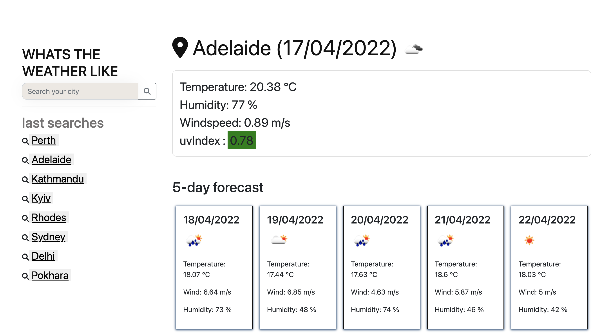

# weather-dashboard

[live link](https://sayamgautam1.github.io/weather-dashboard/)

# Description

The task is to build a weather dashboard that will run in the browser, dynamically updated by HTML and CSS. This a good example to challenge yourself in using the knowledge of third-party APIs

# Purpose

AS A traveler  
I WANT to see the weather outlook for multiple cities  
SO THAT I can plan a trip accordingly

# Features

When you serch for a city , you are presented with current and future conditons of the city, the city is added to the search histoy  
When viewing the current conditon , the user can see the city name, current date, icon represneting current weather condition , current temperature , wind seep, humidity and UVIndex  
When the user looks at the UV index, they can see it is represented with color that reprensents favourable, moderate or severe  
When the user look at future conditons, they are given 5-day forcast, which includes the date, icon representing the conditons, temperature, wind speed, and humidity  
When the user clicks on the searched list , they are redirected back to the city they have already searched before.

# Built with

HTML  
CSS  
BOOTSTRAP  
JavaScript  
Font Awesome  
Moment.js  
OpenWeather API
